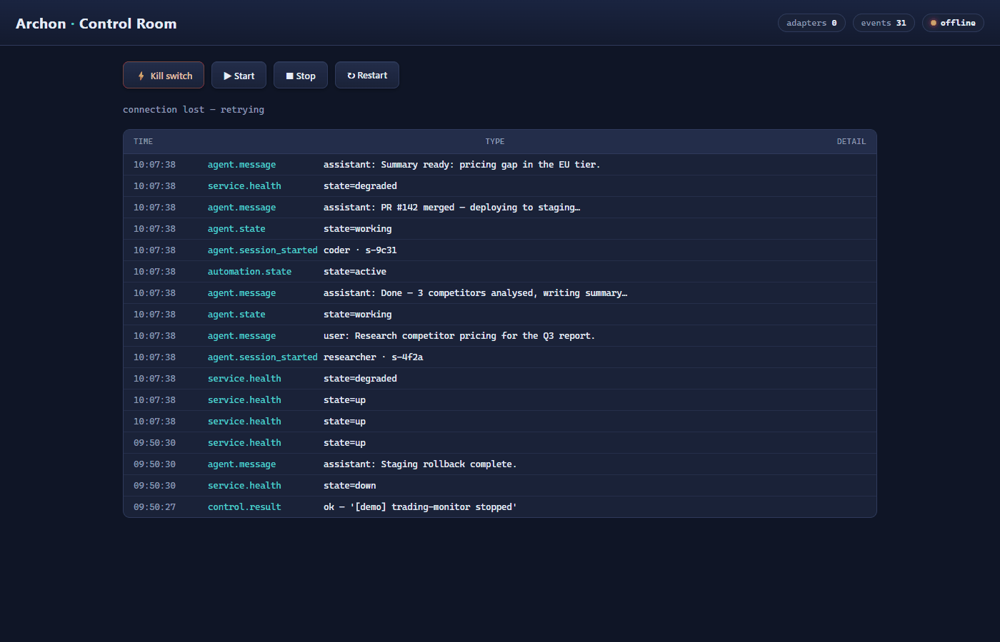

# Archon

**The control room for your AI agent fleet.**

Most agent tooling only *watches*. Archon also gives you the controls — kill
switches, start/stop, restart — so when an agent or automation goes wrong, you
can actually stop it. One live pane for everything your agents are doing, plus
a control API to act on it.

## Why Archon

Running several agents (OpenClaw, Claude Code, CrewAI) plus automations
(Make/n8n) means events scattered across a dozen logs. Archon normalizes them
into a single event stream, streams it live to one dashboard, and — critically
— lets you *act*: hit a kill switch, restart a service, stop an automation.

- **See** — every agent session, automation, and service in one live feed
- **Control** — kill switches, start/stop/restart, pre-configured and safe
- **Alert** — Telegram/webhook on failures and state changes
- **Zero dependencies** — a stdlib Python server + one HTML file

## Quick start

```bash
pip install archon-hq
archon serve --sessions-dir ~/.openclaw-autoclaw/agents/main/sessions \
             --control-config examples/control-config.json
# open http://127.0.0.1:8000
```

From source: `git clone https://github.com/archonhq/archon && cd archon && pip install .`



## How it works

```
framework logs ──► adapter ──► event stream ──► dashboard (HTTP/SSE)
                                    ▲
                               control API
                                    │
framework APIs ◄─────── executor ◄──┘
```

Adapters translate framework-specific logs into one JSON event stream
(see the [telemetry contract](docs/telemetry-contract.md)). The dashboard and
control API consume only that contract — a new framework is one adapter away.

**Control is safe by design.** Commands are pre-configured in a config file,
never supplied by the client. The control API accepts only `{action, target}`
and routes it to a matching command — client input never reaches the shell
unbounded. See [examples/control-config.json](examples/control-config.json).

Adapters: OpenClaw (reference) · Make.com · trading monitor · Claude Code
(planned) · CrewAI (planned) · n8n (planned) · generic webhook (planned)

## Status

Pre-alpha. Reference implementation: OpenClaw adapter. The control plane is
proven in production on a live trading-monitor deployment (kill switch, risk
rails, Telegram alerts, VPS health).

## Roadmap

| Phase | Scope |
|---|---|
| 0 | Telemetry contract, adapters, auth, packaging, landing page |
| 1 | 10–20 self-host users, iterate |
| 2 | Hosted tier (ingest API, multi-tenant, billing) |
| 3 | Trading edition (executor, kill switch, pager) |

## License

MIT
